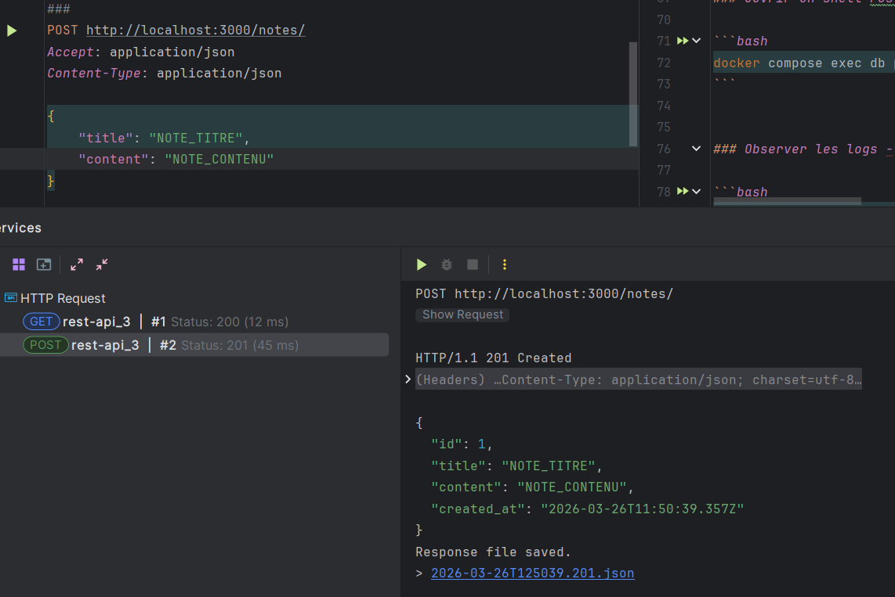
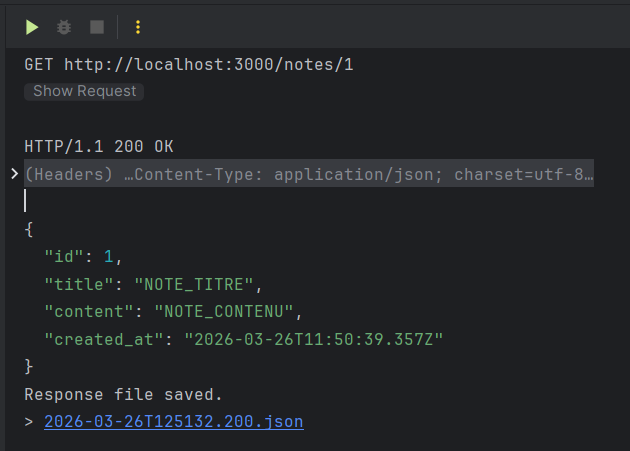

# Notes App — TP Docker & Compose

## Architecture

```
Client → API (Node.js / Express) → Base de données (PostgreSQL)
```
- **API** : stateless, port 3000
- **DB** : stateful, données persistées via volume Docker


## Installation et lancement

### 1. Configurer les variables d'environnement

```bash
cp .env.example .env
```
Le fichier `.env` par défaut fonctionne sans modification. Adapter si nécessaire.

### 2. Lancer le projet

```bash
docker compose up --build
```

L'API est disponible sur [http://localhost:3000].


## Guide d'utilisation

### Vérifier que l'API fonctionne

```bash
curl http://localhost:3000/health
```

Réponse attendue :
```json
{"status": "ok", "db": "connected"}
```

### Créer une note

```bash
curl -X POST http://localhost:3000/notes \
  -H "Content-Type: application/json" \
  -d '{"title": "Ma première note", "content": "Contenu de la note"}'
```

### Lister toutes les notes

```bash
curl http://localhost:3000/notes
```

### Récupérer une note par ID

```bash
curl http://localhost:3000/notes/1
```

### Supprimer une note

```bash
curl -X DELETE http://localhost:3000/notes/1
```


### Observer les logs - utise pour le debug, notemment quand la base de données ne démarre pas -> problème avec la liaison .env intialement

```bash
docker compose logs -f api
docker compose logs -f db
```

### État des services

```bash
docker compose ps
```

---

## Persistance des données — tout est sauvegardé grâce au volume. C'est par lui que les données sont sauvegardées et peuvent être réutilisées sur d'autres containers éventuellement. Les données survivent à un redémarrage des containers grâce au volume `postgres_data` :

**Observation** : la note est bien présente après redémarrage. Le volume `postgres_data` préserve les fichiers de données PostgreSQL.

Pour tester la perte de données :
```bash
docker compose down -v   # supprime le volume
docker compose up -d
curl http://localhost:3000/notes  # retourne []
```

---

## Structure du projet

```
notes-app/
├── .env                  # Variables d'environnement
├── .env.example          # Modèle de configuration
├── .gitignore
├── docker-compose.yml    # Orchestration des services
├── init.sql              # Script d'initialisation de la DB
├── README.md
└── api/
    ├── Dockerfile
    ├── package.json
    └── src/
        └── index.js
```

---


### 

On sépare l'installation des dépendances et la copie du code en copiant d'abord `package*.json` et en éxécuant `npm ci` pour la mise en cache. Elle n'est recalculée que si les dépendances changent. Si on copie tout en une seule fois, le moindre changement de code invalide le cache et `npm ci` est relancé inutilement à chaque build, ce qui ralentit considérablement le développement.

### 

On garde la même image qu'on soit dans un environnement de prod ou de dev car l'image représente l'environnement d'exécution. Si elle est identique entre dev et prod, on élimine la classe d'erreurs en mode "ça marche sur ma machine". La config (secrets, URLs, ports) change selon l'environnement, mais via des variables d'environnement, pas en reconstruisant l'image. 

### 

Dans Docker Compose, chaque service tourne dans son propre réseau isolé. `localhost` dans le container `api` désigne le container `api` lui-même, pas la base de données. Docker Compose crée un réseau interne et résout automatiquement les noms de services en adresses IP : `db` est résolu vers le container PostgreSQL.

---

## Justification des choix techniques

- `node:20-alpine` : Image ultra-légère idéale pour une API Node.js (~50 MB contre ~350 MB pour l'image standard `node:20`).
- `npm ci` : Installation plus rapide et fiable que npm install car elle respecte strictement le fichier package-lock.json.
- `postgres:16-alpine` : Utilisation de la version 16 stable dans son format le plus léger.
- `depends_on (condition: service_healthy)` : Garantit que l'API ne démarre pas tant que la base de données n'est pas totalement prête à accepter des connexions.
- Volume nommé `postgres_data` : Assure la persistance des données même après un docker compose down.
- `init.sql` via `docker-entrypoint-initdb.d/` : Utilise le mécanisme natif de PostgreSQL pour exécuter les scripts d'initialisation au premier lancement.
- `restart: unless-stopped` : Relance automatiquement les conteneurs en cas de crash, sauf s'ils ont été arrêtés manuellement.


<br>

### PREUVES:
 
#### Requêtes HTTP : 

Création de note (POST):


<br> <br>

Récupération de note par ID (GET):




<br>

#### Résultat du lancement Docker Compose :

````
docker compose up --build
#1 [internal] load local bake definitions
#1 reading from stdin 605B done
#1 DONE 0.0s

#2 [internal] load build definition from Dockerfile
#2 transferring dockerfile: 287B 0.0s done
#2 DONE 0.0s

#3 [internal] load metadata for docker.io/library/node:20-alpine
#3 DONE 0.1s

#4 [internal] load .dockerignore
#4 transferring context: 2B done
#4 DONE 0.0s

#5 [internal] load build context
#5 transferring context: 157B done
#5 DONE 0.0s

#6 [1/5] FROM docker.io/library/node:20-alpine@sha256:09e2b3d9726018aecf269bd35325f46bf75046a643a66d28360ec71132750ec8
#6 resolve docker.io/library/node:20-alpine@sha256:09e2b3d9726018aecf269bd35325f46bf75046a643a66d28360ec71132750ec8 0.0s done
#6 DONE 0.0s

#7 [2/5] WORKDIR /app
#7 CACHED

#8 [3/5] COPY package*.json ./
#8 CACHED

#9 [4/5] RUN npm ci --only=production
#9 CACHED

#10 [5/5] COPY . .
#10 CACHED

#11 exporting to image
#11 exporting layers done
#11 exporting manifest sha256:279ffbd251bbd5c033c2333176475e030fa242b16b863c1cf4052c3359172e8b done
#11 exporting config sha256:3ea5513b99e27b016a8c0573fc2bdeb73d2db98859efe21e6690ba21a9fbdd10 done
#11 exporting attestation manifest sha256:b700b75f7c5acd59820f42ef6dca2ff2e79ca922d203c1f568da0ce5bfad89d0 0.0s done
#11 exporting manifest list sha256:104747b1f3f6b6978e8d95e7b96996bfafa736793f6c05a5b888c7ed3df3f9e6
#11 exporting manifest list sha256:104747b1f3f6b6978e8d95e7b96996bfafa736793f6c05a5b888c7ed3df3f9e6 0.0s done
#11 naming to docker.io/library/notes-app-api:latest done
#11 unpacking to docker.io/library/notes-app-api:latest 0.1s done
#11 DONE 0.2s

#12 resolving provenance for metadata file
#12 DONE 0.0s
[+] up 2/2
 ✔ Image notes-app-api       Built                                                                                                                                          1.0s 
 ✔ Container notes-app-api-1 Recreated                                                                                                                                      0.1s 
Attaching to api-1, db-1
Container notes-app-db-1 Waiting                                                                                                                                                 
db-1  |                                                                                                                                                                          
db-1  | PostgreSQL Database directory appears to contain a database; Skipping initialization
db-1  |                                                                                                                                                                          
db-1  | 2026-03-26 13:39:58.880 UTC [1] LOG:  starting PostgreSQL 16.13 on x86_64-pc-linux-musl, compiled by gcc (Alpine 15.2.0) 15.2.0, 64-bit
db-1  | 2026-03-26 13:39:58.881 UTC [1] LOG:  listening on IPv4 address "0.0.0.0", port 5432
db-1  | 2026-03-26 13:39:58.881 UTC [1] LOG:  listening on IPv6 address "::", port 5432
db-1  | 2026-03-26 13:39:58.888 UTC [1] LOG:  listening on Unix socket "/var/run/postgresql/.s.PGSQL.5432"
db-1  | 2026-03-26 13:39:58.894 UTC [29] LOG:  database system was shut down at 2026-03-26 13:39:00 UTC
db-1  | 2026-03-26 13:39:58.906 UTC [1] LOG:  database system is ready to accept connections
Container notes-app-db-1 Healthy                                                                                                                                                 
api-1  | API running on port 3000
````


