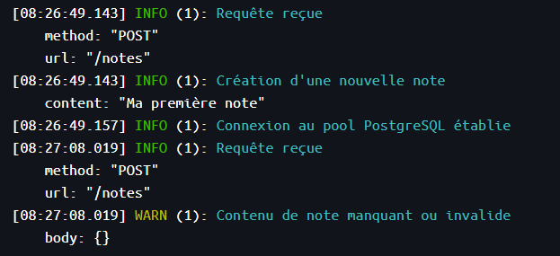
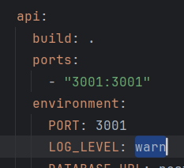
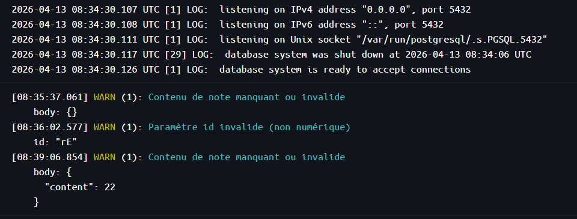

# TP Observabilité — Notes API

API REST Node.js/Express/PostgreSQL instrumentée avec des logs structurés (Pino).

---

## Installation et lancement

### Prérequis
- Docker & Docker Compose

### Démarrer le projet

```bash
docker compose up -d --build
```

L'API est disponible sur `http://localhost:3000`.

### Lancement local (sans Docker)

```bash
cp .env.example .env
# Modifier DATABASE_URL si nécessaire
npm install
npm start
```

Dans le cas d'un lancement avec Docker, les variables d'environnement sont passées via le fichier `docker-compose.yml`. dans le cas d'un lancement à la main, il faut bien penser
à avoir un fichier .env ayant la même structure que le fichier donné en exemple et s'assurer que les variables d'environnement sont correctement configurées par rapport à votre environnement.

---

## Utilisation de l'API

| Méthode | Route        | Description              |
|---------|--------------|--------------------------|
| GET     | `/`          | Statut de l'API          |
| GET     | `/notes`     | Lister toutes les notes  |
| GET     | `/notes/:id` | Récupérer une note       |
| POST    | `/notes`     | Créer une note           |
| DELETE  | `/notes/:id` | Supprimer une note       |

**Exemple — créer une note :**
```bash
curl -X POST http://localhost:3000/notes \
  -H "Content-Type: application/json" \
  -d '{"content": "Ma première note"}'
```

---

## Partie 1 — Logs structurés avec Pino

### Structure du code

- `src/logger.js` : expose l'instance Pino utilisée dans toute l'application
- `src/index.js` : middleware de log de chaque requête entrante
- `src/routes/notes.js` : logs `info`, `warn`, `error` selon le flux

### Niveaux de logs utilisés

| Niveau  | Usage |
|---------|-------|
| `info`  | Flux normal : requête reçue, note créée, serveur démarré |
| `warn`  | Paramètre suspect : id non numérique, content manquant   |
| `error` | Exception ou erreur 500                                  |

### Changer le niveau de log

Modifier la variable d'environnement `LOG_LEVEL` :

```bash
LOG_LEVEL=warn npm start
```

Avec `LOG_LEVEL=warn`, seuls les niveaux `warn` et `error` s'affichent — les `info` sont silencieux.

---

## Questions théoriques — Partie 1

### À quoi ressemble un log issu de `console.log` ?

```
Serveur démarré sur le port 3000
Requête reçue GET /notes
Note créée : { id: 1, content: 'Ma note' }
```

C'est du texte brut, sans format défini, sans horodatage, sans niveau de sévérité.

---

### À quoi ressemble un log issu de `logger` (Pino) ?

```json
{"level":30,"time":1711500000000,"pid":42,"hostname":"api","port":3000,"msg":"Serveur démarré"}
{"level":30,"time":1711500001000,"pid":42,"hostname":"api","method":"GET","url":"/notes","msg":"Requête reçue"}
{"level":50,"time":1711500002000,"pid":42,"hostname":"api","err":{"message":"connection refused"},"msg":"Erreur lors de la récupération des notes"}
```

Chaque ligne est un objet JSON valide avec :
- `level` : sévérité numérique (10=trace, 20=debug, 30=info, 40=warn, 50=error)
- `time` : timestamp Unix en millisecondes
- `pid` / `hostname` : identifiants du processus
- Les champs contextuels ajoutés explicitement (method, url, err…)
- `msg` : message textuel

---

### Quelles sont les différences entre les deux ?

| Critère              | `console.log`                  | `logger` (Pino)                        |
|----------------------|--------------------------------|----------------------------------------|
| Format               | Texte libre                    | JSON structuré                         |
| Niveau de sévérité   | Aucun (sauf `console.error`)   | info / warn / error / debug…           |
| Horodatage           | Absent                         | Présent (`time`)                       |
| Filtrage             | Impossible                     | Par `LOG_LEVEL`                        |
| Contexte             | À la main dans le message      | Champs JSON dédiés                     |
| Parseable par machine| Non                            | Oui (JSON)                             |
| Performance          | Synchrone, bloquant            | Asynchrone, optimisé                   |

---

### Pourquoi ne peut-on pas stocker ces logs dans un fichier de log sur le cloud ?

Dans un environnement cloud, les instances sont éphémères : elles peuvent être créées, déplacées ou supprimées à tout moment. Un fichier de log écrit localement dans le conteneur :

1. Disparaît avec le conteneur à chaque redémarrage ou remplacement du pod/conteneur, le fichier est perdu.
2. N'est pas centralisé si plusieurs instances tournent en parallèle, chacune écrit dans son propre fichier inaccessible aux autres.
3. N'est pas consultable en temps réel par les outils d'observabilité (Datadog, Loki, CloudWatch…).

La bonne pratique cloud-native est d'écrire les logs sur la sortie standard (`stdout`/`stderr`). L'infrastructure (Docker, Kubernetes) collecte ces flux et les achemine vers un système centralisé de gestion des logs. Comme ce que fait Pino par défaut.

---

## Partie 2 — Métriques Prometheus avec prom-client

### Structure du code

- `src/metrics.js` : module centralisé définissant les métriques et le middleware
- `src/index.js` : enregistrement du middleware et de la route `/metrics`

### Métriques exposées

**Métriques système (collectDefaultMetrics)**
Collectées automatiquement : utilisation CPU, mémoire heap, event loop lag, handles actifs, etc.

**Métriques personnalisées :**

| Nom | Type | Description |
|-----|------|-------------|
| `http_requests_total` | Counter | Nombre total de requêtes HTTP |
| `http_request_duration_seconds` | Histogram | Distribution des temps de réponse |

Les deux sont segmentées par labels : `method`, `route`, `status`.

### Observer les métriques

Après plusieurs appels à l'API :

```bash
curl http://localhost:3000/metrics
```

Exemple de sortie :
```
# HELP http_requests_total Nombre total de requêtes HTTP reçues
# TYPE http_requests_total counter
http_requests_total{method="GET",route="/notes",status="200"} 5
http_requests_total{method="POST",route="/notes",status="201"} 2
http_requests_total{method="GET",route="/notes/:id",status="404"} 1

# HELP http_request_duration_seconds Distribution des temps de réponse HTTP en secondes
# TYPE http_request_duration_seconds histogram
http_request_duration_seconds_bucket{le="0.01",method="GET",route="/notes",status="200"} 4
http_request_duration_seconds_bucket{le="0.05",method="GET",route="/notes",status="200"} 5
...
http_request_duration_seconds_sum{method="GET",route="/notes",status="200"} 0.032
http_request_duration_seconds_count{method="GET",route="/notes",status="200"} 5
```

---

## Questions théoriques — Partie 2

### Quelle différence entre `Counter` et `Histogram` ?

Counter compteur strictement croissant, ne peut qu'augmenter (ou être remis à zéro au redémarrage). Il répond à la question "combien de fois ?". Exemples : nombre de requêtes reçues, nombre d'erreurs.

Histogram enregistre la distribution statistique des valeurs observées en les répartissant dans des buckets prédéfinis. Il répond à "comment se distribuent les valeurs ?". Il expose trois séries : `_bucket` (comptage par seuil), `_sum` (somme totale), `_count` (nombre d'observations). Exemples : temps de réponse, taille des payloads.

La différence clé : un Counter dit "8 requêtes ont échoué", un Histogram dit "50% des requêtes répondent en moins de 50ms, 95% en moins de 200ms".

---

## Partie 3 — Health checks

### Structure du code

- `src/routes/health.js` : routes `/health` et `/health/db`

### Comportement

| Endpoint | Service UP + DB UP | Service UP + DB DOWN |
|----------|--------------------|----------------------|
| `GET /health` | `200 {"status":"ok"}` | `200 {"status":"ok"}` |
| `GET /health/db` | `200 {"status":"ok","db":"reachable"}` | `503 {"status":"error","db":"unreachable"}` |

- `/health` répond `200` dès que le processus Node tourne — il ne vérifie pas les dépendances.
- `/health/db` exécute un `SELECT 1` sur le pool PostgreSQL. En cas d'échec, retourne `503 Service Unavailable`.

### Démonstration DB indisponible

```bash
# Stopper uniquement la base de données
docker compose stop db

# /health répond toujours 200 (le process tourne)
curl -i http://localhost:3000/health

# /health/db répond 503
curl -i http://localhost:3000/health/db

# Relancer la DB
docker compose start db
```

---

## Questions théoriques — Partie 3

### À quoi sert `/health/db` comparé à `/health` ?

`/health` répond à la question : "le processus est-il vivant ?". Il retourne `200` dès que l'application tourne, sans vérifier ses dépendances. Un orchestrateur comme Kubernetes l'utilise pour savoir s'il doit redémarrer le conteneur.

`/health/db` répond à la question : "l'application est-elle capable de traiter des requêtes correctement ?". Si la base de données est inaccessible, l'API ne peut pas fonctionner — elle retourne `503` pour signaler qu'elle ne doit pas recevoir de trafic. Un load balancer ou Kubernetes peut ainsi la retirer du pool de routage sans la tuer.

La distinction est essentielle : un service peut être vivant mais pas prêt. Les sortir dans deux endpoints séparés évite de redémarrer inutilement un pod dont la DB est temporairement indisponible.

---

## Commandes de test (curl)

### Démarrer le projet

```bash
docker compose up --build
```

### Statut de l'API

```bash
curl http://localhost:3000/
```

---

### Notes — CRUD

**Lister toutes les notes**
```bash
curl http://localhost:3000/notes
```

**Créer une note**
```bash
curl -X POST http://localhost:3000/notes \
  -H "Content-Type: application/json" \
  -d '{"content": "Ma première note"}'
```

**Créer une deuxième note**
```bash
curl -X POST http://localhost:3000/notes \
  -H "Content-Type: application/json" \
  -d '{"content": "Ma deuxième note"}'
```

**Récupérer la note avec id 1**
```bash
curl http://localhost:3000/notes/1
```

**Récupérer une note inexistante (→ 404 + log warn)**
```bash
curl http://localhost:3000/notes/999
```

**Paramètre invalide (→ 400 + log warn)**
```bash
curl http://localhost:3000/notes/abc
```

**Créer une note sans contenu (→ 400 + log warn)**
```bash
curl -X POST http://localhost:3000/notes \
  -H "Content-Type: application/json" \
  -d '{}'
```

**Supprimer la note avec id 1**
```bash
curl -X DELETE http://localhost:3000/notes/1
```

---

### Métriques Prometheus

```bash
curl http://localhost:3000/metrics
```

**Filtrer uniquement les métriques personnalisées**
```bash
curl -s http://localhost:3000/metrics | grep http_requests
```

```bash
curl -s http://localhost:3000/metrics | grep http_request_duration
```

---

### Health checks

**Liveness — service actif**
```bash
curl -i http://localhost:3000/health
```

**Readiness — DB accessible**
```bash
curl -i http://localhost:3000/health/db
```

**Simuler une panne DB (dans un autre terminal)**
```bash
docker compose stop db
```

**Vérifier le comportement dégradé**
```bash
# Toujours 200 — le process tourne
curl -i http://localhost:3000/health

# 503 — DB inaccessible
curl -i http://localhost:3000/health/db
```

**Relancer la DB**
```bash
docker compose start db
```


## Captures d'écran du fonctionnement :

#### Logs (logs d'infos et de warning pour la création de notes):




<br>

#### Si on change le niveau minimal de log dans le docker-compose.yml :



<br>

#### Voici maintenant les logs visibles dans le conteneur Docker :



Nous avons donc seulement les warnings et les erreurs qui s'affichent :